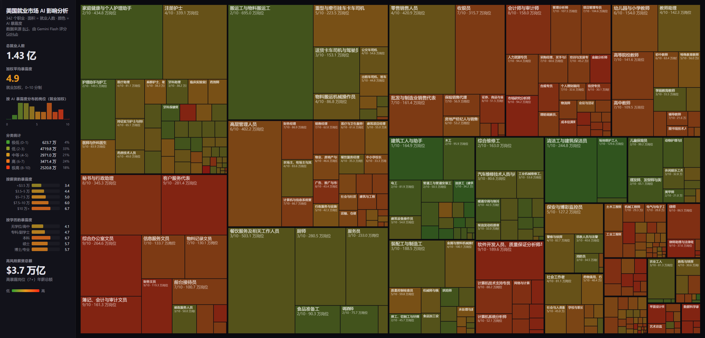

# 美国就业市场 AI 影响分析

基于美国劳工统计局[职业展望手册](https://www.bls.gov/ooh/)（OOH）的数据，分析美国经济中每个职业受 AI 与自动化影响的程度。

**在线演示：[中文版本](https://lolipopj.github.io/jobs-zh-CN/) | [英文版本](https://joshkale.github.io/jobs/)**



## 项目内容

BLS OOH 涵盖 **342 个职业**，涉及美国经济的各个行业，包含职责描述、工作环境、教育要求、薪资水平及就业预测等详细数据。我们对所有数据进行了抓取，使用大语言模型为每个职业的 AI 暴露度评分，并构建了交互式树形图可视化界面。

## 数据处理流程

1. **抓取** (`scrape.py`) — 使用 Playwright（非无头模式，BLS 会屏蔽爬虫）下载全部 342 个职业页面的原始 HTML 至 `html/`。
2. **解析** (`parse_detail.py`, `process.py`) — 使用 BeautifulSoup 将原始 HTML 转换为干净的 Markdown 文件，存放于 `pages/`。
3. **整理** (`make_csv.py`) — 提取结构化字段（薪资、学历、职位数量、就业前景、SOC 代码）至 `occupations.csv`。
4. **评分** (`score.py`) — 将每个职业的 Markdown 描述连同评分标准发送给大语言模型（通过 OpenRouter 调用 Gemini Flash），为每个职业生成 0-10 分的 AI 暴露度评分及理由，结果保存至 `scores.json`。
5. **构建站点数据** (`build_site_data.py`) — 将 CSV 统计数据与 AI 暴露度评分合并，生成前端使用的 `site/data.json`。
6. **网站** (`site/index.html`) — 交互式树形图，面积代表就业人数，颜色代表 AI 暴露度（绿色至红色）。

## 关键文件

| 文件               | 说明                                              |
| ------------------ | ------------------------------------------------- |
| `occupations.json` | 342 个职业的主列表，含标题、URL、分类、slug       |
| `occupations.csv`  | 汇总统计：薪资、学历、职位数量、就业增长预测      |
| `scores.json`      | 全部 342 个职业的 AI 暴露度评分（0-10）及评分理由 |
| `html/`            | 来自 BLS 的原始 HTML 页面（数据来源，约 40MB）    |
| `pages/`           | 每个职业页面的 Markdown 版本                      |
| `site/`            | 静态网站（树形图可视化）                          |

## AI 暴露度评分

每个职业在单一的 **AI 暴露度**维度上获得 0 至 10 分，衡量 AI 将对该职业产生多大程度的重塑。评分同时考虑直接自动化（AI 直接完成工作）和间接效应（AI 大幅提升生产效率，导致所需人力减少）。

关键判断依据是职业的工作成果是否本质上属于数字化内容——若该职业可完全在家通过计算机完成，则 AI 暴露度天然较高。反之，需要实地操作、手工技能或实时人际互动的职业则具有天然屏障。

**数据集中的校准示例：**

| 分数 | 含义 | 示例                                   |
| ---- | ---- | -------------------------------------- |
| 0-1  | 极低 | 屋顶工、清洁工、建筑工人               |
| 2-3  | 低   | 电工、水管工、护理助理、消防员         |
| 4-5  | 中等 | 注册护士、零售工人、医生               |
| 6-7  | 高   | 教师、经理、会计师、工程师             |
| 8-9  | 极高 | 软件开发者、法律助理、数据分析师、编辑 |
| 10   | 最高 | 医疗转录员                             |

全部 342 个职业的平均暴露度：**5.3/10**。

## 可视化

主可视化为交互式**树形图**：

- 每个矩形的**面积**与就业人数成正比
- **颜色**表示 AI 暴露度，从绿色（安全）到红色（高风险）
- **布局**按 BLS 分类对职业进行分组
- **悬停**显示详细提示框，包含薪资、职位数、就业前景、学历要求、暴露度评分及大语言模型评分理由

## 环境配置

```bash
uv sync
uv run playwright install chromium
```

需在 `.env` 文件中配置 OpenRouter API 密钥：

```bash
OPENROUTER_API_KEY=your_key_here
```

## 使用方法

```bash
# 抓取 BLS 页面（仅需一次，结果缓存于 html/）
uv run python scrape.py

# 从 HTML 生成 Markdown
uv run python process.py

# 生成 CSV 汇总
uv run python make_csv.py

# 评估 AI 暴露度（调用 OpenRouter API）
uv run python score.py

# 构建网站数据
uv run python build_site_data.py

# 本地启动网站
cd site && python -m http.server 8000
```
